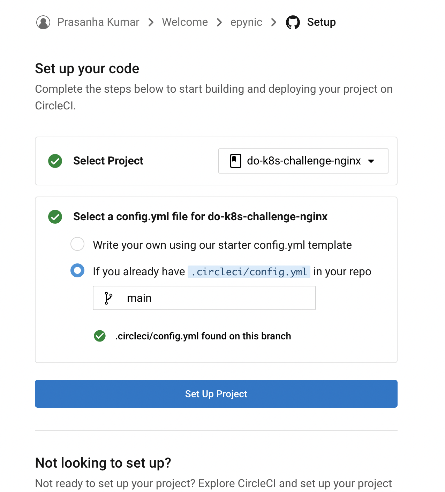
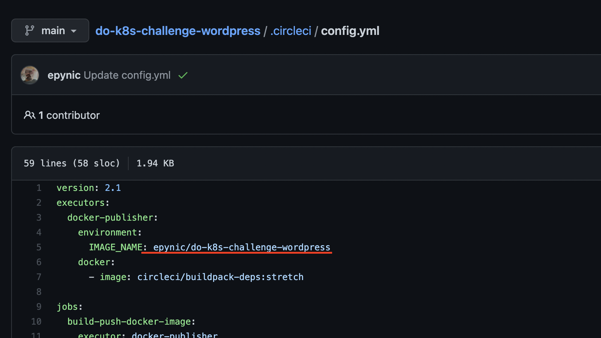
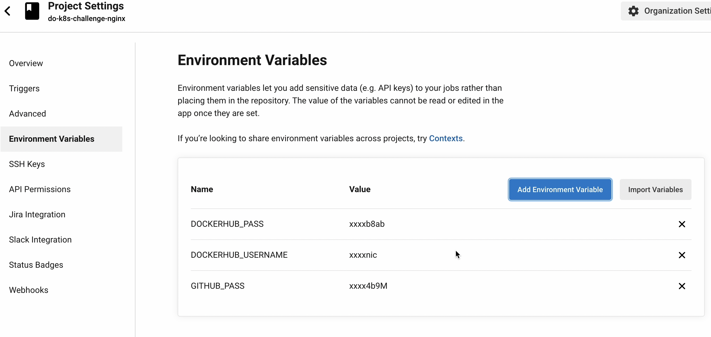
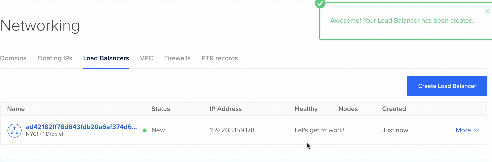
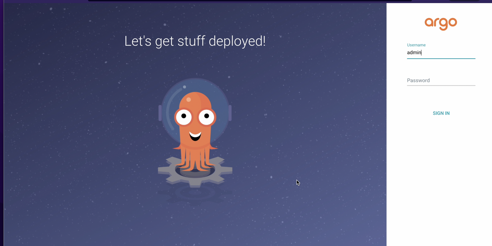
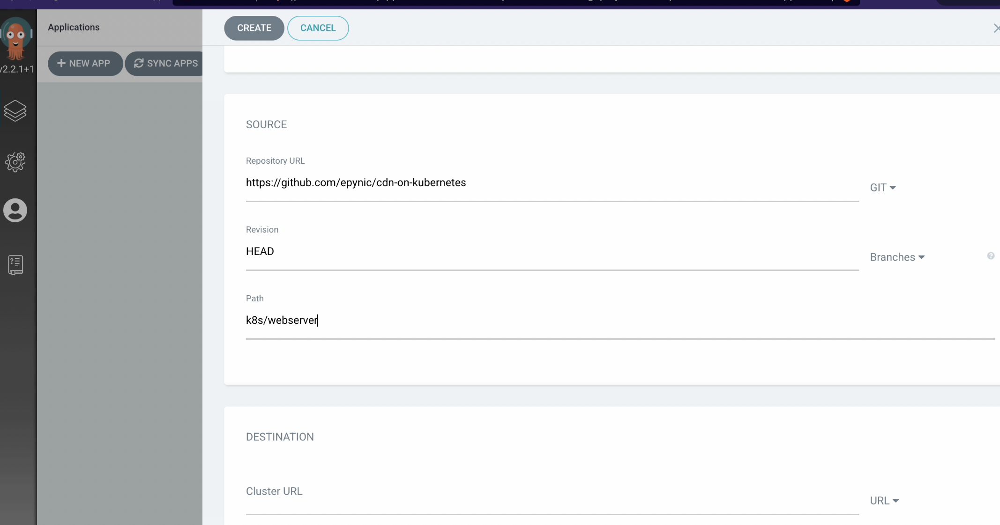
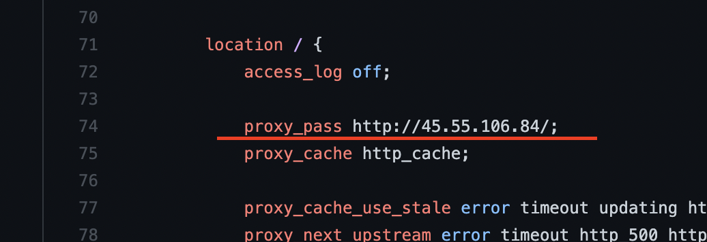

# Cross-Region CDN running on DO Kubernetes cluster

Part of the  DeployHQ - Challenge https://www.digitalocean.com/community/pages/kubernetes-challenge

#### Objective :
To have a complete CI/CD pipeline to build and deploy in a k8s environment ie after a code push in the application repo, CI pipeline should build the container image and push it to dockerhub and update the k8s manifest file in git, and finally an CD tool that would apply the latest manifiest files in the k8s cluster.

Stack: #circleci #argocd #k8s #wordpress #nginx

#

For this project we would be building an CDN (kind of technically)


### What is a CDN 
In simple terms a content delivery network (CDN) refers to a geographically distributed group of servers (proxy servers) that stores a copy of the `origin` (webapp) close to the users. 

`origins` are just web apps and the CDN functions as a proxy server.


[https://www.cloudflare.com/en-in/learning/cdn/what-is-a-cdn/](https://www.cloudflare.com/en-in/learning/cdn/what-is-a-cdn/)


##  Prerequisites
To complete this tutorial, we’ll need:
* [A DigitalOcean Personal Access Token](https://docs.digitalocean.com/reference/api/create-personal-access-token/).
* Terraform installed.

Follow the Digital Ocean tutorial for the same
https://www.digitalocean.com/community/tutorials/how-to-use-terraform-with-digitalocean


👉 [To Setup a development droplet](./terraform/modules/droplet)


## Getting Started
We have 2 parts in the project
1. The `Origin` that would server the cotent. (wordpress)
2. The `Proxy Server` that would cache the origin.(nginx)


# Origin Server (wordpress)

We have a seperate repo that has the Dockerfiles to build the wordpress image.

https://github.com/epynic/do-k8s-challenge-wordpress

We will be using [CircleCI](https://circleci.com/) to build the container image and to update the Kubernetes manifest files with the latest container image.

The DockerImage will be hosted in [DockerHub](https://hub.docker.com/)

## Step 1 
#### DockerHub Repo & Access Token
- Create an account and the repo to upload the container image in [DockerHub](https://hub.docker.com/repository/docker/epynic).
- In my case the repo would be named as `epynic/do-k8s-challenge-wordpress`.
- https://hub.docker.com/repository/docker/epynic/do-k8s-challenge-wordpress/tags
- Create a dockerhub access-token from the link https://hub.docker.com/settings/security this will be used in circleci to push the container images. 

## Step 2
#### CircleCI Project Setup
- Fork the repo https://github.com/epynic/do-k8s-challenge-wordpress
- Create an account in [CircleCI](https://circleci.com/), (use the `Sign up with Github`, for easier project setup in circleci).
- Authorize CircleCI for repo access. 
- Select the project, and select the circle-config option.[circle-ci config files are already created](https://github.com/epynic/do-k8s-challenge-wordpress/blob/main/.circleci/config.yml).



- Update the circleci config with your docker-hub image
path: https://github.com/epynic/do-k8s-challenge-wordpress/



- Add the required environement variable in CircleCI project settings. 




````
DOCKERHUB_USERNAME
DOCKERHUB_PASS
GITHUB_PASS
````
* [Link Create DockerHub Access Token](https://hub.docker.com/settings/security)
* [Link Create GitHub Access Token](https://github.com/settings/tokens)


## Setup 3
#### Create k8s cluster for the `origin` (wordpress)

````
cd terraform/cluster_webserver/
terraform init
terraform apply -var-file=vars.tfvars
````

`terraform apply` would create a k8s cluter with a single-node and the kubeconfig required to access the cluster would be save in the kubeconfig directory.

## Setup 4
#### ArgoCD setup

- We will be using ArcoCD, that will help us manage the application in kubernetes.
- Follow the link to setup ArgoCD in our cluster https://argo-cd.readthedocs.io/en/stable/getting_started.
- 
```
kubectl create namespace argocd
kubectl apply -n argocd -f https://raw.githubusercontent.com/argoproj/argo-cd/stable/manifests/install.yaml
https://argo-cd.readthedocs.io/en/stable/getting_started/
```
- The last command will create an Loadbalacer with the argo-service exposed. [DO Loadbalancers link](https://cloud.digitalocean.com/networking/load_balancers)



-  The Loadbalancer IP will open up the Argo login page 



- username = admin and use the command `kubectl -n argocd get secret argocd-initial-admin-secret -o jsonpath="{.data.password}" | base64 -d; echo` to get the password.
- Create a new project with the repo URL/path and save.



- The deployment would start and you would have another Loadbalancer created that would expose the wordpress service.

To use the kubeconfig generated in step 3 use the the kubectl as

`kubectl --kubeconfig=./terraform/cluster_sebservice/kubeconfig/kube-web get pods`

## Cache (proxy-server) (nginx)
For the nginx we need to follow the same steps as done for the origin server.

1. Terraform script to create the k8s cluster across regions.
 [https://github.com/epynic/cdn-on-kubernetes/tree/main/terraform/cluster_cdn](https://github.com/epynic/cdn-on-kubernetes/tree/main/terraform/cluster_cdn)

2. Nginx repo to build the container image
[https://github.com/epynic/do-k8s-challenge-nginx
](https://github.com/epynic/do-k8s-challenge-nginx
)

Update the Orgin Loadbalancer IP in the nginx config file and commit.



3. Docker hub repo 
[https://hub.docker.com/repository/docker/epynic/do-k8s-challenge-nginx](https://hub.docker.com/repository/docker/epynic/do-k8s-challenge-nginx)

4. k8s manifest files 
[https://github.com/epynic/cdn-on-kubernetes/blob/main/k8s/cdn/nginx-deployment.yaml](https://github.com/epynic/cdn-on-kubernetes/blob/main/k8s/cdn/nginx-deployment.yaml
)

#

Thats all we would now have a complete CI/CD pipeline that when we make a code change in the repo would start the build in circle-ci to build the container image and push the image to dockerhub and update the k8s manifest file in git and argocd with sense the cofiguration drift in the manifest and apply the latest manifiest files.

Ofcourse I would say this project can be a starter for a CDN project in k8s, and there are much more things pending like geoDNS routing, cache invalidations and much more to have a fully functional DNS.


🍻 Cheers Digital Ocean. https://try.digitalocean.com/kubernetes-in-minutes/
